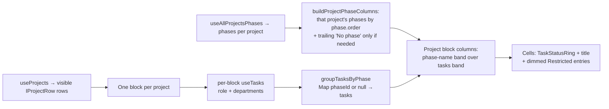

# Issue #166 — Projects List/Table/Timeline views + Print, and hide Insights nav

## Goal
Two related, self-contained changes on the **firm dashboard** surface only (`apps/web`,
`dashboard.siapp.app/:workspaceSlug/*`):

- **Change A — Temporarily hide Insights.** Detach the Insights section from the firm shell
  (remove the sidebar nav item and the `insights` route) so it is unreachable, while keeping
  **all** `insights/*` source + tests in the repo so it can be restored later.
- **Change B — Projects views.** Add an accessible, URL-driven **List / Table / Timeline**
  view switcher to the Projects page plus a **Print** button that cleanly prints the active
  view. **List** is the current UI unchanged; **Table** is a phases × projects matrix built
  from our own phases/tasks data (respecting task department need-to-know); **Timeline** reuses
  the all-projects Gantt originally built for Insights (#164).

This is presentation/UX only over existing live subscriptions (`useProjects`, `usePhases`,
`useTasks`). **No new Firestore collections, fields, security rules, or composite indexes.**
Bundle isolation is preserved — all work stays inside the firm surface (D-036/D-037); no portal
`/p`, collaborator `/t`, marketing apex, `admin.siapp.app`, or `@siapp/ui` changes. The Timeline
reuse follows the #164 / D-042 precedent (a fresh firm-surface Gantt, not the portal Gantt).

---

## Recommendations on the open design decisions
1. **Phases-as-columns → PER-PROJECT phase bands (no global shared columns).** Each project is
   its own stacked block; **that project's OWN phases are the columns** (ordered by `phase.order`),
   each column split into a **phase-name band (top)** and a **tasks band (bottom)** where each task
   is a `TaskStatusRing` + truncated title. A trailing **"No phase"** column is appended **only
   when** the project has tasks with `phaseId: null` (or an orphan phaseId). There is **no
   cross-project column alignment** — projects have heterogeneous phases, so each block sizes to
   its own phases and scrolls horizontally on its own. Rationale: matches that projects genuinely
   have different phase sets, and it's simpler — no name normalization or union needed. (The
   earlier union-of-normalized-names approach is rejected: projects don't share a standardized
   phase set.) Guard overflow with a per-block labelled horizontal-scroll region + the project cap
   (see #3).
2. **Timeline → MOVE it to `projects/timeline/`.** Move `ProjectsTimeline.tsx`,
   `ProjectsTimeline.test.tsx`, and the exported pure helper `projectsTimelineDates` into
   `apps/web/src/surfaces/firm/projects/timeline/`. Projects is now its primary (and only live)
   consumer; the dormant `InsightsPage` re-imports from the new location. `StatusDonut` /
   `PortfolioStats` / `insightsStatus` stay in `insights/`. (Cross-folder import within the firm
   surface would also be legal per D-036/D-037, but moving keeps the live code with its live
   owner and avoids importing from a dormant folder.)
3. **Cross-project loading → REUSE `useTasks` per row + one small phases-fanout hook, bounded.**
   - Add `useAllProjectsPhases(workspaceId, projectIds)` that manages **N phase subscriptions**
     (phases are **not** department-restricted) and returns `Map<projectId, IPhaseRow[]>` +
     aggregate state — feeding **each project block's own** columns (no shared header).
   - Render one `<ProjectTableRow>` **per visible project**; each row calls the **existing**
     `useTasks(workspaceId, projectId, role, departments)` hook **unchanged**, so the
     owner/admin raw subscription vs pm/viewer `array-contains` fan-out + restricted-header
     callable is respected automatically (we do **not** reimplement `taskQueriesFor`). Rows are
     naturally lazy — only mounted rows subscribe.
   - **Cap** the Table at a bounded number of projects (recommend **25**). Above the cap, render
     a "Too many projects to show as a table — narrow the filters" notice instead of mounting
     dozens of live subscriptions. Document the scale caveat.
4. **Print → ONE shared, generalized print region + one page-level Print button.** Generalize
   the Timeline's proven isolation pattern (`body * { visibility: hidden }` reveal + scale-to-fit
   + static `<style media="print">`) into a shared `projects/print/` module keyed on a stable
   `#projects-print-root` id. The Projects page renders a single **Print** button in the switcher
   toolbar that prints the currently-active view: **portrait** for List, **landscape scale-to-fit**
   for Table and Timeline. The moved `ProjectsTimeline` gains a `showInternalPrint` prop (default
   `true`, so the dormant `InsightsPage` is unchanged); the Projects Timeline view passes
   `showInternalPrint={false}` and lets the page's shared Print button drive it.

---

## Touched surfaces & files

### Surface
Firm dashboard only: `dashboard.siapp.app/:workspaceSlug/projects` (Change B) and the firm shell
nav/routes (Change A). No other surface touched.

### Change A — hide Insights
- **Modify** `apps/web/src/surfaces/firm/FirmShell.tsx`
  - Remove the Insights `<NavItem to={`/${workspace.slug}/insights`} label="Insights" …>`.
  - Remove the `<Route path="insights" element={<InsightsPage … />}>`.
  - Remove the now-unused `import { InsightsPage } from './insights/InsightsPage.tsx';`.
  - Remove the now-unused `BarChart3` from the `lucide-react` import and delete the
    `insights: <BarChart3 … />` entry from `NAV_ICONS` (avoid unused-var lint).
- **Modify** `apps/web/src/surfaces/firm/FirmShell.test.tsx`
  - Delete `it('renders the insights section at /insights', …)` and
    `it('exposes an Insights nav link, active on /insights', …)`.
  - Remove the `vi.mock('./insights/InsightsPage.tsx', …)` mock (no longer rendered by the shell).
  - Add one assertion that the Workspace nav does **not** expose an "Insights" link
    (`expect(within(nav).queryByRole('link', { name: 'Insights' })).toBeNull()`) and that
    `/acme/insights` no longer renders the Insights heading.
- **KEEP UNCHANGED** (dormant, must still compile + pass): all of
  `apps/web/src/surfaces/firm/insights/*` — `InsightsPage.tsx(.test)`, `PortfolioStats.tsx(.test)`,
  `StatusDonut.tsx(.test)`, `insightsStatus.ts(.test)`, `index.ts`, and the moved-timeline
  re-export (see Change B / decision #2).

### Change B — Projects views
Create:
- `apps/web/src/surfaces/firm/projects/projectsView.ts` — `TProjectsView = 'list'|'table'|'timeline'`,
  `DEFAULT_PROJECTS_VIEW = 'list'`, `parseProjectsView(sp)`, `writeProjectsView(sp, view)` (default omitted).
- `apps/web/src/surfaces/firm/projects/projectsView.test.ts`
- `apps/web/src/surfaces/firm/projects/ProjectsViewSwitcher.tsx` — thin wrapper over `@siapp/ui`
  `SegmentedControl` (already `role="radiogroup"` + roving-tabindex `role="radio"` buttons,
  keyboard-accessible). Options: List / Table / Timeline.
- `apps/web/src/surfaces/firm/projects/matrix/ProjectsTableView.tsx` — the semantic `<table>` matrix.
- `apps/web/src/surfaces/firm/projects/matrix/ProjectTableRow.tsx` — one project block; calls existing `useTasks`.
- `apps/web/src/surfaces/firm/projects/matrix/useAllProjectsPhases.ts` — N phase subscriptions → per-project columns input.
- `apps/web/src/surfaces/firm/projects/matrix/projectsMatrix.ts` — **pure**, **per-project** builders:
  `buildProjectPhaseColumns(phases)` (order by `phase.order`, append `"No phase"` only when needed)
  and `groupTasksByPhase(tasks)` → `Map<phaseId|null, ITaskRow[]>`. (No union / `normalizePhaseName`.)
- `apps/web/src/surfaces/firm/projects/matrix/projectsMatrix.test.ts` — pure builder unit tests.
- `apps/web/src/surfaces/firm/projects/matrix/ProjectsTableView.test.tsx`
- `apps/web/src/surfaces/firm/projects/print/printView.ts` — shared print constants/style string +
  `computeScaleToFit(el, targetPx)` helper (extracted/generalized from the Timeline pattern).
- `apps/web/src/surfaces/firm/projects/print/ProjectsPrintStyle.tsx` — the single static
  `<style media="print">` block targeting `#projects-print-root` (landscape/portrait via a data attr).
- `apps/web/src/surfaces/firm/projects/print/printView.test.ts`

Move (git mv, decision #2):
- `apps/web/src/surfaces/firm/insights/ProjectsTimeline.tsx`
  → `apps/web/src/surfaces/firm/projects/timeline/ProjectsTimeline.tsx`
- `apps/web/src/surfaces/firm/insights/ProjectsTimeline.test.tsx`
  → `apps/web/src/surfaces/firm/projects/timeline/ProjectsTimeline.test.tsx`
- Update internal relative imports (it currently imports `../projects/LifecycleBadge`,
  `../projects/projectLabels`, `../projects/useProjects` → become `../LifecycleBadge`, etc.).

Modify:
- `apps/web/src/surfaces/firm/projects/ProjectsListPage.tsx`
  - Read/write the `view` param; render `ProjectsViewSwitcher` + shared **Print** button in the
    header toolbar (when `projects.status === 'ready' && rows.length > 0`).
  - Wrap the active view's content in `<div id="projects-print-root" data-print-orientation=…>`
    and render `<ProjectsPrintStyle>` once.
  - **List view = the existing `<ul>` block, byte-for-byte unchanged** (extract into a
    `ProjectsListView` local render or keep inline behind `view === 'list'`).
  - `view === 'table'` → `<ProjectsTableView projects={visible} … role departments workspaceId />`.
  - `view === 'timeline'` → `<ProjectsTimeline projects={visible} workspaceSlug showInternalPrint={false} />`.
  - Keep the existing filter/search controls (`ProjectsListControls`) visible for all three views;
    all views consume the same filtered `visible` set (see open question OQ-2).
- `apps/web/src/surfaces/firm/projects/timeline/ProjectsTimeline.tsx` — add `showInternalPrint?: boolean`
  (default `true`); when `false`, suppress its own Print button + internal `<style>` (the page owns print).
- `apps/web/src/surfaces/firm/insights/InsightsPage.tsx` — update the import to
  `../projects/timeline/ProjectsTimeline.tsx` (dormant, but must still compile).
- `apps/web/src/surfaces/firm/insights/index.ts` — re-export `ProjectsTimeline` /
  `projectsTimelineDates` from the new path (keep the barrel API stable for the dormant code).

---

## Data model changes
**None.** No new collections, documents, fields, security rules, or composite indexes.

- **Reads reused as-is:**
  - `useProjects(workspaceId)` — already loaded on the page; excludes `deleted`.
  - `usePhases(workspaceId, projectId)` — whole `phases` collection (not department-restricted).
  - `useTasks(workspaceId, projectId, role, departments)` — the department need-to-know hook:
    owner/admin subscribe to the raw `tasks` collection; **pm/viewer** get one
    `where('restrictedToDepartments','==',[])` query + one `array-contains` query per claim
    department, deduped by id, plus the `getRestrictedTaskHeaders` callable for dimmed rows.
- **Rules/index implication:** the Table only issues **more instances of the exact query shapes
  that already exist** (per project). `taskQueriesFor` uses equality / `array-contains` only
  (no composite indexes by design), and phases is a plain collection read. So **no new rules,
  no new indexes**. Multi-tenant workspace isolation is unchanged: every path is
  `workspaces/{workspaceId}/…` and reads flow through the same rules-proven hooks.

---

## Steps (each independently verifiable)

### A. Hide Insights
1. Edit `FirmShell.tsx`: drop the Insights `<NavItem>`, the `insights` `<Route>`, the
   `InsightsPage` import, the `BarChart3` import, and the `NAV_ICONS.insights` entry. Verify:
   sidebar has no Insights link; `/:slug/insights` renders nothing (falls through Routes).
2. Update `FirmShell.test.tsx` per the file list. Verify the suite is green and includes a
   negative assertion (no Insights link; `/insights` doesn't render the Insights heading).
3. Run typecheck/lint on `insights/*` to confirm the dormant code still compiles with no
   unused-export errors (barrel `index.ts` still re-exports everything; nothing else in the app
   imports it now — that is expected and not a lint error since it's an exported barrel).

### B. Timeline move
4. `git mv` `ProjectsTimeline.tsx` + test into `projects/timeline/`; fix its relative imports;
   update `insights/InsightsPage.tsx` and `insights/index.ts` to the new path. Verify the moved
   test passes unchanged (aside from import path) and `insights/*` still compiles.

### B. View switcher + URL state
5. Add `projectsView.ts` (+ test): parse/write `view`, default `list` omitted from URL. `parse`
   validates against the union and falls back to `list` for unknown values.
6. In `ProjectsListPage.tsx`, read `view` from `searchParams`; add `ProjectsViewSwitcher`
   (SegmentedControl) in the header toolbar; switching writes the param via `setSearchParams`
   (`replace: true`) preserving all filter params. Verify the URL updates and back/forward works.
   Confirm `writeProjectsListParams` continues to **preserve** `view` when filters change (it
   carries non-owned params through its `preserve` loop).

### B. Table view
7. Add `projectsMatrix.ts` **per-project** pure builders + tests: `buildProjectPhaseColumns(phases)`
   (ordered by `phase.order`, trailing `"No phase"` **only when** null-phase tasks exist) and
   `groupTasksByPhase(tasks)` → `Map<phaseId|null, ITaskRow[]>`. No union / `normalizePhaseName`.
8. Add `useAllProjectsPhases.ts`: subscribe to phases for each capped project id, expose
   `Map<projectId, IPhaseRow[]>` + `loading/error/ready` (feeds each block's own columns).
9. Add `ProjectTableRow.tsx` (one **project block**): calls `useTasks(...)`, groups `ITaskRow` by
   `phaseId` via `groupTasksByPhase`, renders that project's OWN phase columns (from
   `buildProjectPhaseColumns`) — each column a phase-name band (top) over a tasks band (bottom)
   with `TaskStatusRing` (reused primitive — status-based, shape + sr-only label, not colour-alone)
   + task title; renders dimmed `IRestrictedHeaderRow` rows as a muted "🔒 Restricted (N hidden)"
   entry in the relevant phase's band (or a per-project restricted note when the phase is unknown);
   per-block loading skeleton + error cell.
10. Add `ProjectsTableView.tsx`: renders the capped list of `ProjectTableRow` blocks stacked
    vertically. Each block is its own semantic `<table>` (project name = `<caption>`/heading + link;
    phase-name band = `<thead>` `<th scope="col">`; tasks band = a `<tbody>` row of task-list cells)
    inside a labelled `role="region"` per-block horizontal scroll container. Apply the project **cap**
    with an over-cap notice. Empty states: no projects, project with no phases, empty cell (sr-only
    "No tasks").
11. Wire `view === 'table'` in the page to render `ProjectsTableView` over `visible`.

### B. Print
12. Add `projects/print/printView.ts` + `ProjectsPrintStyle.tsx`: generalize the Timeline's
    static `@page`/visibility/scale block to `#projects-print-root`; keep `@page` a **static
    string literal**; include `print-color-adjust: exact` so rings/bars/progress print. Orientation
    from `data-print-orientation` (`portrait` for List, `landscape` for Table/Timeline).
13. Add the page-level **Print** button: for Table/Timeline, measure the print root's `scrollWidth`
    and set `--projects-print-scale` (scale-to-fit, never upscale) before `window.print()`; for
    List, portrait, no scaling. Pass `showInternalPrint={false}` to the embedded Timeline.
14. Manual print preview (Chrome) for each view: no sidebar/app chrome, no cropping, colours retained.

---

## Table design (detail)

Visual shape — **each project is its own block; that project's OWN phases are the columns, each
split into a phase-name band (top) over a tasks band (bottom); cells = tasks + a small status
ring**. Projects have DIFFERENT phase sets — there is no cross-project column alignment:

```text
 ┌─ F1 · Lot 12  [Published] ────────────────────────────────────────────────────────────────────────┐
 │ Phase ▸  Earthworks     │ Road & Drain    │ Landscape       │ Fire Dept Appr. │ No phase          │→
 │ Tasks ▸  ● Clear site   │ ◑ Lay kerb      │ ◔ Turfing plan  │ ◔ BOMBA submit  │ ◔ Site photos     │
 │          ● Cut & fill   │ ◔ Drain RC      │                 │                 │  (phaseId: null)  │→
 └────────────────────────────────────────────────────────────────────────────────────────────────────┘

 ┌─ F2 · Lot 7  [Published] ──────────────────────────────────────────────────────────┐
 │ Phase ▸  Excavation     │ Culvert         │ Softscape       │ BOMBA               │   (its own, different phases)
 │ Tasks ▸  ◑ Dig to level │ ⊘ Box culvert   │ ◔ Topsoil       │ ● Approved          │
 │          (empty)        │  (help needed)  │ ◔ Shrubs        │                     │
 └──────────────────────────────────────────────────────────────────────────────────┘

 ┌─ F3 · Lot 21  [Draft] ───────────────────────────────────────────────┐
 │ Phase ▸  Earthworks     │ Road Base       │ Fire Dept Appr.         │   (no Landscape phase → no such column;
 │ Tasks ▸  ● Clear site   │ ◑ Road base     │ 🔒 Restricted (2 hidden)│    no null-phase tasks → no "No phase" column)
 └──────────────────────────────────────────────────────────────────────┘

 Legend:  ◔ todo    ◑ in progress    ⊘ blocked    ● done    🔒 Restricted (task exists, content hidden for role)
 Notes:
  • Each block sizes to its OWN phases (ordered by phase.order) and scrolls horizontally on its own (→).
  • "No phase" is a trailing per-project column, shown ONLY when that project has phaseId: null tasks (F1 has one; F2/F3 don't).
  • F3 simply has no "Landscape" phase, so there is no Landscape column in its block (no empty shared cell).
  • A phase with no tasks shows an empty tasks band (e.g. F2 "Excavation" → "(empty)" / sr-only "No tasks").
  • F3 viewed by a pm/viewer: department-restricted tasks show as a dimmed "🔒 Restricted (N hidden)"
    entry in the phase's task band (or a per-project note if the phase can't be determined) — nothing leaks.
  • Real cells render the existing <TaskStatusRing status=…> SVG (shape + fill + sr-only status
    label — not colour-alone); the ASCII glyphs above are for this document only.
```

Data → structure build (per project, no cross-project union):



- **Column model (per project):** the columns are **that project's own phases**, ordered by
  `phase.order`, from `useAllProjectsPhases`; a trailing **"No phase"** column is appended **only
  when** the project has tasks with `phaseId: null` or an orphan `phaseId`. There is **no**
  cross-project union and **no** name normalization — blocks are independent.
- **Blocks:** one per visible (filtered, non-deleted) project, capped at 25; each block's header is
  the project name linking to `/:slug/projects/:id`, with `LifecycleBadge` + optional `code`.
- **Cells:** within a phase column's tasks band, the tasks whose `phaseId` maps to that phase, each
  shown as `TaskStatusRing` + truncated task title (stacked list). Dimmed restricted-header rows
  render as a muted "🔒 Restricted (N hidden)" entry in the relevant phase's band (or a per-project
  restricted note when the phase is unknown) so pm/viewer see something exists without leaking.
- **Per-task indicator:** **reuse `TaskStatusRing`** (`projects/tasks/TaskStatusRing.tsx`) — it
  maps `todo|in_progress|blocked|done` to shape+fill+`sr-only` label (not colour-alone).
  `TaskProgressRing` is completion-count based, so it's the wrong primitive here.
- **States:** per-block loading skeleton while that project's phases/tasks load; per-block error on
  `useTasks`/phases error; empty project list, project-with-no-phases, and empty tasks band all
  handled with sr-only text.
- **Accessibility:** each project block is its **own** semantic `<table>` with a `<caption>` (or a
  preceding heading) = the project name; the phase-name band is `<thead>` with `<th scope="col">`
  per phase; the tasks band is a `<tbody>` row of task-list cells. Each block sits in its own
  labelled `role="region"` (`aria-label="{project name} phases"`) `tabIndex={0}` horizontal-scroll
  container; rings carry sr-only status; links are keyboard reachable; no colour-alone signalling.

## Data-loading design (detail)
- Phases: `useAllProjectsPhases` opens N phase subscriptions (unrestricted read). Cheap (a handful
  of phases/project).
- Tasks: per-row `useTasks` — owner/admin = **1** live query/project; pm/viewer = **1 +
  departments.length** live queries/project + 1 restricted-headers callable. The Table never
  attempts to read tasks a role can't see — it only calls the existing rules-proven hook.
- **Performance / scale caveats:** live subscription count ≈ `N × (1 phases + tasksQueries)`. With
  the 25-project cap and a pm in, say, 2 departments this is ≈ `25 × (1 + 3)` = 100 listeners —
  bounded and acceptable for the Table view (only while it's the active view; switching away
  unmounts rows and tears down listeners). Above the cap we show a "narrow the filters" notice
  rather than mounting more. Documented as a known v1 limit; a future aggregate/roll-up read could
  raise the ceiling but is out of scope.
- **Confirmed: no new Firestore rules or indexes** (same query shapes, more instances).

## View-switcher (detail)
- `view` search param, values `list|table|timeline`, default `list` (omitted from URL for a clean
  default, consistent with `projectsListFilter` omitting defaults). Unknown/absent → `list`.
- Kept **separate** from `IProjectsListParams` to avoid churning the well-tested filter
  serialization; `writeProjectsListParams`' `preserve` path already carries `view` through filter
  changes (it's a non-owned key).
- Reuses `@siapp/ui` `SegmentedControl` → `role="radiogroup"` with roving-tabindex
  `role="radio"` buttons and arrow-key handling (already accessible; no new primitive needed).

## Print (detail)
- One shared static `<style media="print">` (via `ProjectsPrintStyle`) targeting
  `#projects-print-root`: `body * { visibility: hidden }` then reveal the root; `@page { size: … }`
  a **static literal**; `transform: scale(var(--projects-print-scale,1))` origin top-left;
  `print-color-adjust: exact`. Orientation switched by `data-print-orientation` (two static
  `@page`/`@media` blocks, or a single block with the size chosen via the attribute — both keep
  `@page` static).
- One page-level Print button drives all three views; Timeline's own button is suppressed when
  embedded (`showInternalPrint={false}`) so there's exactly one Print control.

---

## Test plan (Vitest + RTL)
- **projectsView.test.ts** — parse defaults to `list`; unknown value → `list`; round-trip
  write/parse; default omitted from URL.
- **projectsMatrix.test.ts** — **per-project** builders: `buildProjectPhaseColumns` orders a
  project's phases by `phase.order` and appends `"No phase"` **only when** null-phase tasks exist
  (and omits it otherwise); `groupTasksByPhase` returns `Map<phaseId|null, ITaskRow[]>` placing
  tasks under the right phase incl. the null bucket.
- **ProjectsTableView.test.tsx** — renders **one block per project**, each with its OWN phase
  columns from mocked `usePhases`/`useTasks`; **two projects with different phase sets render
  independently** (no shared/aligned columns); a `TaskStatusRing` per task; a phase with no tasks
  shows an empty tasks band ("No tasks"); a project with no phases and the `"No phase"`-only case;
  **restricted-header rows render as a dimmed "🔒 Restricted (N hidden)" entry** in the phase's
  band; **role fan-out**: with `role='pm'` + departments, assert it only renders tasks returned by
  the (mocked) `useTasks` and never assumes access to restricted content; per-block loading/error
  states; over-cap notice above 25 projects; each block is a semantic `<table>` with `caption` +
  `th[scope=col]` phase headers inside its labelled scroll region.
- **ProjectsListPage.test.tsx** (extend) — switcher renders; selecting Table/Timeline updates the
  `view` URL param and swaps the rendered view; default is List; **List view markup is unchanged**
  (existing list assertions still pass); filter changes preserve `view`.
- **ProjectsTimeline.test.tsx** (moved) — still passes from the new path; `showInternalPrint={false}`
  hides its own Print button/style.
- **print** — clicking Print sets up `#projects-print-root` + orientation and calls
  `window.print` (spied); Table/Timeline set a `--projects-print-scale` ≤ 1 when `scrollWidth` is
  measurable (guarded for jsdom); List doesn't scale.
- **FirmShell.test.tsx** — no "Insights" nav link; `/insights` doesn't render the Insights heading;
  the removed tests/mock are gone; suite green.
- **Dormant insights suite** — `insights/*` tests still pass unchanged after the timeline move.
- **Accessibility (axe):** the repo **already depends on `axe-core`** and the existing Insights
  tests use it — reuse that exact pattern: `import axe from 'axe-core';` then
  `const results = await axe.run(container, { rules: { region: { enabled: false }, 'color-contrast': { enabled: false } } }); expect(results.violations).toEqual([]);`.
  Add axe assertions for the view switcher and a rendered Table block (plus direct role/semantics
  assertions: radiogroup/radio for the switcher; `table`/`caption`/`th[scope]`/`region[aria-label]`
  for each project block; sr-only status text on rings). **No new dependency needed** (OQ-1 resolved).

---

## Out of scope
- Any change to Insights behaviour/content beyond detaching it from the shell (it stays dormant).
- Persisting/expanding tasks inline, editing tasks/phases from the Table, or per-cell task CRUD.
- New progress semantics (tasks remain status-based; no per-task percent is introduced).
- New Firestore fields/collections/rules/indexes, or any aggregate/roll-up read.
- Portal `/p`, collaborator `/t`, marketing apex, `admin.siapp.app`, or `@siapp/ui` changes.
- Timeline horizontal pagination for very tall/long ranges (unchanged from #164 behaviour).
- Raising the Table project cap via a new data model.

## Risks / open questions
- **OQ-1 (a11y tooling): RESOLVED.** The repo already depends on `axe-core` (`apps/web`) and the
  existing Insights tests run `axe.run(...)`; the Table + switcher tests reuse that same pattern,
  so no new dependency and no human call is required.
- **OQ-2 (Timeline input set):** Insights fed the Timeline **all** non-deleted projects; in the
  Projects page filters are present. **Recommendation:** feed all three views the same filtered
  `visible` set for a coherent UX. This is a minor product change vs. Insights' behaviour —
  confirm acceptable, or keep Timeline on the full non-deleted set.
- **OQ-3 (Table cap value):** 25 is a proposed bound for listener count. Confirm the number, or
  whether an explicit "load more"/on-demand expansion is preferred over a hard cap.
- **Restore note:** Change A leaves `insights/*` as exported-but-unimported code. If the repo's
  lint flags unused barrel exports (it currently should not, since `index.ts` re-exports), we may
  need a lint-ignore; flagged so Builder/Validator watch for it.

## Extensibility
- The `view` param + `SegmentedControl` switcher generalizes to future views (e.g. Board) with no
  URL-scheme change.
- `projectsMatrix.ts` pure builders isolate the column/grouping logic for reuse (e.g. export).
- The shared `#projects-print-root` print region is view-agnostic — new views print for free by
  living inside the print root and declaring an orientation.
- Restoring Insights = re-add the `NavItem` + `Route` + imports in `FirmShell.tsx` (and its two
  tests); the timeline stays in `projects/timeline/` and Insights keeps importing it.
