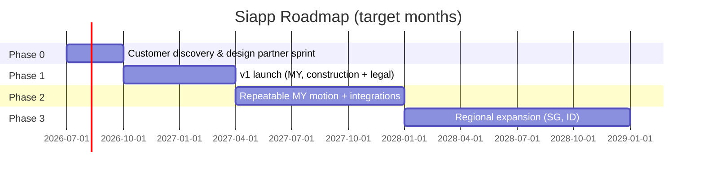

# Product Roadmap

Phases are gated by **metrics**, not dates. We move when the previous gate is proven, not when the calendar says so.

## Roadmap at a glance

## Phase 0 — Discover & co-build (Months 0–3)

**Gate to enter Phase 1:** discovery stage-gate in [customer discovery plan](./10-customer-discovery-plan.md) cleared; v1 scope frozen; design partners on the concierge MVP for ≥ 4 weeks.

| Track | Deliverables |
|---|---|
| Discovery | 40 interviews, validated H1–H8, pricing finalized, pilot LOIs signed |
| Product | Concierge MVP with Notion + manual WhatsApp; v1 design files; tech architecture accepted |
| Brand | Name finalized, logo + 1-page guide, domain secured |
| Ops | Entity registered, contracts, PDPA framework, BSP onboarding started |

## Phase 1 — v1 launch (Months 3–9)

**Gate to enter Phase 2:** see "Phase 1 success" in [GTM strategy](./07-gtm-strategy.md). Core metrics: ≥ 30 paying logos, NRR ≥ 100%, retention ≥ 90%.

Major workstreams (sequenced):

1. **Sprint A (Months 3–4):** core data model, auth, workspace, projects, tasks, documents, notes.
2. **Sprint B (Months 4–5):** duplicate-project flow + Siapp-Admin starter-project provisioning seeds (D-031), client portal v1, magic-link auth.
3. **Sprint C (Months 5–6):** WhatsApp BSP integration, notification rules engine, audit log.
4. **Sprint D (Months 6–7):** admin panel (plan management, seats, renewals), trial expiry automation, overage metering & in-app forecast. **No Stripe at MVP** (D-019 — manual billing).
5. **Sprint E (Months 7–8):** mobile polish, performance pass. (BM localization moved to Phase 2 per D-026 — i18n scaffold still lands in v1.)
6. **Sprint F (Month 8):** beta with 5–10 closed-beta firms.
7. **Public launch (Month 9):** open signup, launch content, association partnerships.

**Stripe + FPX integration:** deferred to Phase 2 (Months 9–18), triggered when ≥ 20 paying customers, OR billing admin time > 4 hrs/week, OR first auto-renewal request.

### Phase 1 themes (not tickets)

- **Activation:** every signup should reach "first WhatsApp sent" within a single sitting.
- **Trust:** uptime, audit log, deletion endpoint, PDPA notice.
- **Distribution loop:** client portal must be share-worthy.

## Phase 2 — Repeatable motion (Months 9–18)

**Gate to enter Phase 3:** ≥ 200 paying logos, CAC payback < 6 months, ≥ 1 scaled channel proven (association, partner, or content), NRR ≥ 110%.

| Theme | What ships |
|---|---|
| Localization | **BM UI** for firm app, client portal, collaborator page (deferred from v1 per D-026); BM Twilio Content Templates; BM marketing site |
| Templates | Evaluate demand for customer-facing template authoring (D-031 revisit gate). If demand is real, scope template authoring UI for v2. Marketplace stays deferred. |
| Integrations | SQL Account or AutoCount; DocuSign; Google Drive sync |
| Portal | Full white-label (custom subdomain) on Business+; configurable acknowledgements |
| Messaging | Multi-channel routing rules (WhatsApp → SMS → email); customer's own sender on Scale |
| PM features | Saved views, bulk edit, basic dependencies, simple Gantt-style timeline |
| Mobile | PWA install prompts, offline notes draft, push notifications |
| Analytics | Per-firm benchmarks ("your median residential build = 11.5 months vs. cohort 10.2") |
| Reliability | 99.9% SLA on Scale+, formal status page, postmortems |

## Phase 3 — Regional expansion (Months 18–36)

Gates: ≥ 800 logos across SEA, $1M+ ARR, churn < 1.5% monthly, partner channel contributing > 30%.

- **Singapore (M18–22):** English-only, higher ARPA, anchor 5 design partners. Compliance updates for PDPA Singapore.
- **Indonesia (M22–28):** Bahasa Indonesia UI, local BSP, local payment (GoPay/OVO/QRIS), warm intros to design+build firms.
- **Vertical expansion (M22+):** interior design, accounting, migration consultancies — add new Siapp-Admin starter-project seeds per vertical; evaluate customer-facing template engine if firms ask for it.
- **Platform features:** API tier, SSO, data residency choices, AI-assisted starter-project / duplicate suggestions, multi-workspace.

## Cross-cutting themes (always-on)

- **Reliability & security:** every quarter, one engineering week dedicated to security/perf/observability.
- **Customer success:** monthly cohort review with 5 customer interviews; feed into roadmap.
- **Documentation:** every shipped feature lands with a 1-page guide in English (BM translation follows the v1.5 BM launch per D-026).

## Roadmap rules

- **One quarter, one theme.** Not five.
- **Anything not on the current roadmap is "not now."** "Not now" ≠ "no" but ≠ "next sprint."
- **Cut before adding.** New scope requires explicit older scope removal.
- **Customer asks ≠ roadmap.** Patterns of 3+ paying customers asking for the same thing → considered.
- **Quarterly retro on what we cut.** If we cut something that should have shipped, that's a signal.

## What we will NOT roadmap (multi-year defensive list)

- Becoming a horizontal PM tool (no "custom field engines" without ICP demand).
- Building our own WhatsApp BSP.
- Generic chat / community / forum features.
- "Co-pilot" AI features that aren't directly tied to starter-project scaffolding or message drafting.
- Mobile native unless usage analytics show PWA limits are blocking customers.

## Open product decisions

- Per-project pricing variant for construction (decide by end of Phase 1).
- Whether to introduce a customer-facing template engine at all vs. extending Siapp-Admin starter-project seeds + duplicate (decide by Month 12, gated on D-031 revisit signals).
- Whether to acquire an existing MY-built solution (e.g. a small Sheets-based PM tool with a customer base) to accelerate Phase 2.
